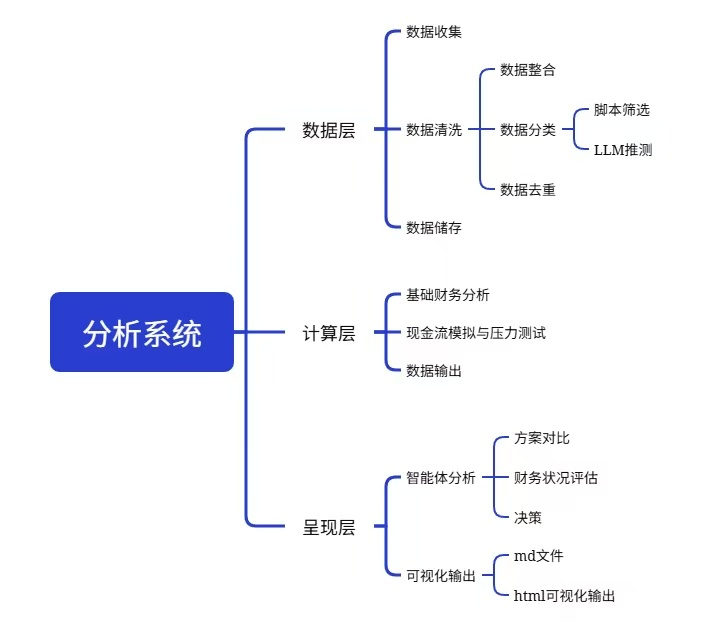

# Billweave

中文 | **[English](docs/README_EN.md)**

> 可审计的个人财务分析工具，专为微信/支付宝/银行账单格式设计。

[](https://www.python.org/) [](LICENSE)

BillWeave 是一款专为个人打造的账单管理与分析工具。
它旨在帮助个人用户轻松整理、清洗并汇总各类零散的账单数据，自动生成清晰直观的财务报告。通过简单的命令行操作，你可以快速完成从原始账单到可视化报表的转换，让个人财务复盘变得简单高效。

## ✨ 特性



| | |
|---|---|
| **三层分离** | 数据层 / 计算层 / 呈现层各自独立，中间产物 JSON/CSV 全部可审计 |
| **6 级优先级去重** | 退款1>退款2>平台互转>跨平台结算>交易关闭>资金移动兜底，串行执行 |
| **多格式解析** | CSV（GBK）、Excel（含元信息行）、PDF（无表格线文本排版）——自动适配编码和表头位置 |
| **AI 打标** | 无关键词匹配的交易由 Agent 推测类别写入待确认队列，推测值直接显示在账本"类别"列，用户一键终审批量确认 |
| **待确认队列** | 无法归类交易进入队列，AI 预填推测类别 + 幂等保留；`--export-pending-mark` 导出 CSV 手工标记，`--confirm-file` 批量固化 |
| **固定资产 / 未来支出** | 维护 `confirm/fixed_assets.json` 与 `confirm/fixed_expenses.json`，`overview` 自动计入总资产与未来 90 天确定支出 |
| **Agent 友好** | 天然适配 Hermes/Claude/任意 Agent 编排为 cron 定时任务 |

## 🏗️ 架构

```
工作目录/
├── bills/              ← 你的原始账单（支持 csv/xlsx/pdf）
│   ├── 微信/
│   ├── 支付宝/
│   └── 招商银行/
├── balance/            ← 余额快照（xlsx/csv/pdf）
├── debt/               ← 债务记录
├── confirm/            ← 待确认交易 CSV + 用户维护清单（固定资产/固定支出 JSON）
├── results/            ← 自动生成（git 忽略）
│   ├── raw/
│   │   ├── global_bill/           ← 数据层输出（CSV + JSON）
│   │   └── calculation_results/   ← 计算层输出（JSON）
│   └── reports/                   ← 渲染层输出（MD + HTML）
├── templates/          ← 内置报告模板（Jinja2）
└── config.yaml         ← 工作区配置（可选）
```

### 三层管线

1. **数据层** `billweave ledger` — 读取所有账单 → 6 级优先级去重 → 关键词分类 → **按年输出**标准化交易清单
2. **计算层** `billweave overview` / `billweave weekly` / `billweave scenario` / `billweave quarter` — 从当年账本计算各类指标（用 `--year` 指定年份，默认当前年）
3. **呈现层** `billweave render` — Jinja2 模板 → Markdown + HTML 报告

每层只读前层输出，不做隐式依赖。任何中间文件损坏不影响其他层。

> **从 1.1.x 升级**：首次运行 `billweave ledger` 时，旧版无年份产物（`global_ledger.csv`、`summary.json` 等）会自动归档到 `results/_旧版/<时间戳>/`，新按年产物（`global_ledger_2026.csv` 等）随后自动生成，不会丢数据。

## 🚀 快速上手

### 安装

```bash
pip install billweave
```

### 生成合成样例（跳过导入账单）

```bash
# 生成虚拟账单用于测试（微信/支付宝/招行/余额/债务全套合成数据）
billweave sample --workspace .

# 跑一遍完整管线（数据层按年输出 → 计算层用当年账本 → 渲染层）
billweave ledger --workspace . && \
billweave overview --workspace . && \
billweave weekly --workspace . && \
billweave quarter --workspace . && \
billweave render --latest --workspace .

# 排障：新接入账单后先用 inspect-match 看看脚本"看到了什么"
billweave inspect-match --workspace .
```

### 接入真实账单

按约定目录存放你的微信/支付宝导出文件和银行 PDF，运行同样的命令即可。

```
bills/                          # 根目录下放账单
├── 微信/                       # 平台名 = 子目录名
│   ├── 微信支付_20260701.xlsx  # 可以是任意文件名
│   └── 微信支付_20260801.csv
├── 支付宝/
│   └── 支付宝明细.csv
└── 招商银行/
    └── 招行流水.pdf
```

### 待确认交易手工标记

脚本无法识别类别的交易进入"待确认队列"（`pending_queue_{year}.csv`）。AI 推测类别会直接回填到全局账本的"类别"列（仍带"待确认"标记），让你能核对。

```bash
# 1. 导出待确认标记 CSV 到 confirm/（列: 日期|平台|金额|币种|项目|AI推测类别|用户标记类别）
billweave ledger --export-pending-mark --workspace <路径>

# 2. 打开 confirm/待确认标记_2026.csv，在"用户标记类别"列填写最终类别（留空=跳过，填"不确定"=拒绝AI推测）

# 3. 批量固化用户标记
billweave ledger --confirm-file confirm/待确认标记_2026.csv --workspace <路径>

# 可选：--default-ai 对用户未标记且未拒绝、但 AI 有具体推测的交易自动按推测固化
billweave ledger --confirm-file confirm/待确认标记_2026.csv --default-ai --workspace <路径>
```

固化后重跑 `overview` / `weekly` / `quarter` / `render` 即可让各报告同步。

### 生成报告

```bash
# 概览报告（总资产、负债、健康评估）
billweave overview --workspace <路径>

# 周报（本周 vs 上周）
billweave weekly --workspace <路径>

# 重大支出方案（一次付 vs 分期 vs 推迟 vs 暂不付）
billweave scenario --amount 10000 --pay-date 2026-12-01 --safety-line 5000 --workspace <路径>

# 季度账本（按年全局账本切片，自动创建/更新当年已过季度）
billweave quarter --workspace <路径>             # 当前季度
billweave quarter --workspace <路径> --year 2026 # 自动补齐 2026 年已过季度

# 统一渲染所有最新 JSON 为报告
billweave render --latest --workspace <路径>
```

#### overview 可选：固定资产 / 固定支出清单

`overview` 会额外读取 `confirm/` 下的两份 JSON（**均为顶层数组、UTF-8、均可缺省**，缺省时静默跳过）：

| 文件 | 字段 | 计入口径 |
|------|------|----------|
| `confirm/fixed_assets.json` | 资产类型 / 名称描述 / 估值 / 币种 / 估值日期 / 备注 | 估值 > 0 的条目计入"其他资产合计"（并入总资产） |
| `confirm/fixed_expenses.json` | 名称 / 日期(YYYY-MM-DD) / 金额 / 币种 / 类别 / 备注 | 仅日期落在 **今天 ~ 今天+90 天** 窗口内的计入"未来三个月确定支出"；窗口外条目只提示不计入 |

示例：

```bash
# 运行 sample 会自动在 confirm/ 生成这两份文件；也可手写同名 JSON
billweave sample --workspace .
```

> 说明：固定资产现值需你按实际维护（如笔记本、自行车），JSON 解析失败只会警告、不会中断计算。若用 Agent 编排，重跑 `overview` / `render` 即可让报告同步这两份清单。

## 📋 支持的账单格式

| 平台 | 格式 | 已知问题 | 处理方式 |
|------|------|--------|----------|
| 微信支付 | xlsx | 前 17 行元信息 | 自动检测表头（关键词评分） |
| 支付宝 | CSV (GBK) | 非 UTF-8 编码 | GBK→UTF-8 自动转换 |
| 招商银行 | PDF | 无表格线、纯文本排版 | 按列宽分桶解析 |
| 余额快照 | xlsx/csv | 横表/竖表两种布局 | 自动检测表头结构 |

详细规则见 [docs/dedup-rules.md](docs/dedup-rules.md)。

## 🎯 适用场景

- **个人记账**：放入账单，自动生成可视化报告
- **预算规划**：用 scenario 模块做大额消费前的现金流压力测试
- **Agent 集成**：配合 Hermes/OpenClaw 等 Agent 设为每周自动账本（cron）
- **开发者**：参考去重逻辑和解析层代码，处理你自己的财务数据源

## ⚠️ 免责声明

本工具为辅助分析工具，分类基于规则和关键词匹配。请在使用前自行核对关键金额，作者对使用本工具产生的任何结果不承担责任。

## 📄 License

MIT License — 随意使用、修改、分发，但请保留版权说明。

## 💡 贡献

欢迎提交 issue 和 PR。特别是：
- 新增账单格式解析支持
- 模板美化
- 错误修复和性能优化
- 翻译

## 👏 特别鸣谢

Billweave 的诞生离不开开源社区的滋养，特别感谢以下优秀项目：

- **[Jinja2](https://jinja.palletsprojects.com/)** — 提供强大而优雅的报告渲染引擎。
- **[pdfplumber](https://github.com/jsvine/pdfplumber)** — 解决无表格线 PDF 账单文本排版与分桶解析的关键利器。
- **[pandas](https://pandas.pydata.org/)** — 为复杂的账单数据清洗、字段对齐与去重提供底层支持。
- **[Rich](https://github.com/Textualize/rich)** — 让终端命令行交互与日志输出更加美观易读。

同时也感谢所有提交 Issue、PR 以及测试反馈的开源伙伴！