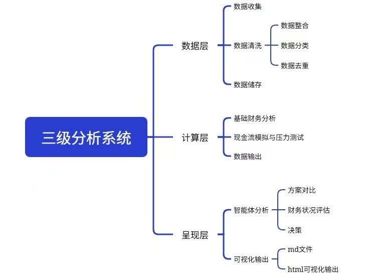

# Billweave

**[中文](../README.md)** | English

> A local-first, auditable personal finance analyzer built for WeChat Pay, Alipay, and Chinese bank statements.

[](https://www.python.org/) [](LICENSE)

Billweave is a personal bill management and analysis toolkit that turns messy, scattered transaction exports into clean financial reports — all on your own machine, with nothing ever leaving your computer.

Export your statements from WeChat Pay, Alipay, or your bank, drop them into a folder, and run a single command. Billweave applies a 6-level priority deduplication pipeline (refund1 → refund2 → platform transfer → cross-platform settlement → closed trade → fund movement fallback), categorizes transactions, and renders Markdown + HTML reports you can review at a glance. Ledgers are split by year, so each year's records stay clean and isolated.

## ✨ Features



| | |
|---|---|
| **Three-layer pipeline** | Separate data, computation, and presentation layers — every intermediate JSON/CSV is auditable |
| **6-level priority dedup** | Refund1 > Refund2 > Platform transfer > Cross-platform settlement > Closed trade > Fund movement fallback — executed serially, higher-priority matches don't re-enter lower rules |
| **Yearly ledger** | Data layer splits the ledger by year (`global_ledger_{year}.csv`); legacy non-yearly artifacts auto-archived on first run |
| **Multi-format parsing** | Handles CSV (GBK), Excel (with metadata rows), and PDF (text-layout, no table lines) — auto-detects encoding and header positions |
| **AI-assisted categorization** | Transactions that don't match any keyword rule get a suggested category from your AI agent — batch-confirm in one step |
| **Pending-aware totals** | Overview/weekly stats include pending transactions (cash has already moved) and show a "confirmed" comparison field |
| **Pending review queue** | Unclassified transactions land in a review queue with AI-prefilled categories; your decisions are remembered permanently (idempotent re-runs) |
| **100% local** | No external APIs, no network calls, no data uploads — everything stays on your machine |
| **Agent-friendly** | Designed to slot into any AI agent workflow — schedule as a cron job with Hermes, Claude, or any orchestration layer |
| **Statement triage tool** | `billweave inspect-match` inspects header detection, field hits, and income/expense distribution — run it first whenever you add new statement formats |

## 🏗️ Architecture

```
workspace/
├── bills/              ← Your raw statements (csv / xlsx / pdf)
│   ├── 微信/           ← WeChat Pay exports
│   ├── 支付宝/         ← Alipay exports
│   └── 招商银行/       ← Bank statements
├── balance/            ← Balance snapshots (xlsx / csv / pdf)
├── debt/               ← Debt records
├── results/            ← Auto-generated (gitignored)
│   ├── raw/
│   │   ├── global_bill/           ← Data layer output (CSV + JSON)
│   │   └── calculation_results/   ← Compute layer output (JSON)
│   └── reports/                   ← Render layer output (MD + HTML)
├── templates/          ← Built-in report templates (Jinja2)
└── config.yaml         ← Workspace config (optional)
```

### Three-layer pipeline

1. **Data layer** `billweave ledger` — Reads all statements → 6-level priority dedup → keyword-classifies → **outputs a yearly ledger** (`global_ledger_{year}.csv`)
2. **Compute layer** `billweave overview` / `billweave weekly` / `billweave scenario` / `billweave quarter` — Calculates financial metrics from the ledger of a given year (use `--year` to specify, defaults to current year)
3. **Render layer** `billweave render` — Jinja2 templates → Markdown + HTML reports

Each layer reads only from the previous layer's output. No implicit dependencies. A corrupted intermediate file won't break the other layers.

> **Upgrading from 1.1.x**: On first run of `billweave ledger`, legacy non-yearly artifacts (`global_ledger.csv`, `summary.json`, etc.) are auto-archived to `results/_archive/<timestamp>/`. New yearly artifacts (`global_ledger_2026.csv`, etc.) are then generated — no data loss.

## 🚀 Quick Start

### Install

```bash
pip install billweave
```

### Try it with synthetic data (no real statements needed)

```bash
# Generate a full set of synthetic bills (WeChat / Alipay / bank / balance / debt)
billweave sample --workspace .

# Run the full pipeline (data layer outputs by year → compute layer uses the year's ledger → render layer)
billweave ledger --workspace . && \
billweave overview --workspace . && \
billweave weekly --workspace . && \
billweave quarter --workspace . && \
billweave render --latest --workspace .

# Triage: after adding new statements, run inspect-match first to see what the script "sees"
billweave inspect-match --workspace .
```

### Use your real statements

Export your statements and organize them by platform:

```
bills/                          # Top-level bills directory
├── 微信/                       # Platform name = subdirectory name
│   ├── 微信支付_20260701.xlsx  # Any filename works
│   └── 微信支付_20260801.csv
├── 支付宝/
│   └── 支付宝明细.csv
└── 招商银行/
    └── 招行流水.pdf
```

Then run the same commands against that directory.

### Generate reports

```bash
# Financial overview (total assets, liabilities, health assessment)
billweave overview --workspace <path>

# Weekly summary (this week vs. last week)
billweave weekly --workspace <path>

# Major expense scenario analysis (pay now vs. installment vs. defer vs. skip)
billweave scenario --amount 10000 --pay-date 2026-12-01 --safety-line 5000 --workspace <path>

# Quarterly ledger (sliced from the yearly ledger; auto-creates/updates past quarters of the year)
billweave quarter --workspace <path>             # current quarter
billweave quarter --workspace <path> --year 2026 # auto-fills all past quarters of 2026

# Render all latest JSON results into reports
billweave render --latest --workspace <path>
```

## 📋 Supported Statement Formats

| Platform | Format | Known Quirk | How Billweave Handles It |
|----------|--------|-------------|--------------------------|
| WeChat Pay | xlsx | First 17 rows are metadata | Auto-detects header row via keyword scoring |
| Alipay | CSV (GBK) | Non-UTF-8 encoding | Converts GBK → UTF-8 on the fly |
| CMB (招商银行) | PDF | No table lines, plain text layout | Parses by column-width bucketing |
| Balance snapshot | xlsx / csv | Wide or tall layout | Auto-detects table structure |

Detailed dedup rules are documented in [docs/dedup-rules.md](docs/dedup-rules.md).

## 🎯 Use Cases

- **Personal bookkeeping** — Drop monthly exports into the folder, get auto-generated visual reports
- **Budget planning** — Run the `scenario` module for cash-flow stress testing before a big purchase
- **Agent integration** — Pair with Hermes or any AI agent to run weekly reconciliation as a cron job
- **For developers** — Study the dedup logic and parsers as a reference for handling your own financial data sources

## ⚠️ Disclaimer

Billweave is an analysis aid. Categorization is based on rules, keyword matching, and optional AI suggestions. Always verify key figures yourself before making financial decisions. The author assumes no liability for decisions made based on this tool's output.

## 📄 License

MIT License — use, modify, and distribute freely. Just keep the copyright notice.

## 💡 Contributing

Issues and PRs are welcome. Areas where help is especially appreciated:

- New statement format parsers
- Report template improvements
- Bug fixes and performance optimization
- Translations

## 👏 Acknowledgements

Billweave stands on the shoulders of excellent open-source projects:

- **[Jinja2](https://jinja.palletsprojects.com/)** — Powerful and elegant report rendering engine
- **[pdfplumber](https://github.com/jsvine/pdfplumber)** — The key tool for parsing text-layout PDFs without table lines
- **[pandas](https://pandas.pydata.org/)** — Underlying support for complex data cleaning, field alignment, and deduplication
- **[Rich](https://github.com/Textualize/rich)** — Beautiful terminal output and CLI interactions

And thanks to everyone who has opened an issue, submitted a PR, or provided feedback.
